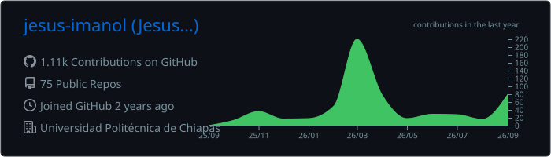
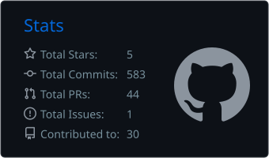
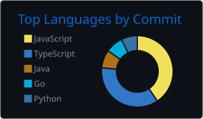

<!-- Header -->

  

  
  
  
  

---

## About

<table>
  <tr>
    <td width="55%" valign="middle">

Software Engineering student at **Universidad Politécnica de Chiapas**, building software the way you'd build anything meant to last: **structure first, details later.**

I work on two fronts. On the **backend**, with Go, Node.js and Supabase — APIs, real-time systems and event-driven designs. On the **client**, with React, Next.js, Vue and Flutter — PWAs, hybrid apps and offline-first experiences.

I've shipped work across **fintech, e-commerce, IoT and Web3**, and I'm the kind of engineer who wants to know how things work underneath — which is why I've written a compiler for fun.

</td>
    <td width="45%" align="center" valign="middle">
      
    </td>
  </tr>
</table>

---

## How I think about software

<table>
  <tr>
    <td width="45%" align="center" valign="middle">
      
    </td>
    <td width="55%" valign="middle">

**Architecture is a decision, not an accident.** 
Domains, boundaries and contracts come before implementation.

**Simple beats clever.** 
The best code is the code the next person understands.

**Correctness is proven, not assumed.** 
Tests and CI are the contract the system has to honor.

**Fundamentals outlast frameworks.** 
Tools change every year; data structures, design and trade-offs don't.

**Tools amplify judgment — they don't replace it.** 
I use AI to move faster inside a design I own and understand. Every line I ship is a line I can explain.

</td>
  </tr>
</table>

---

## Experience

| | Project | Role | What I built |
|---|---|---|---|
| `2026` | **ConoceMex** · Talent Land México | Frontend / UX-UI | Flutter app + Next.js PWA on Supabase (PostGIS, Edge Functions, RLS), Mercado Pago OAuth and geolocated recommendations over an event-driven modular monolith |
| `2025` | **Monii** · Monilio Tech Solutions | Frontend & Mobile | Cashless fintech: React PWA + Vue/Ionic app with QR scan-to-order, offline-first storage, service layer, >70% test coverage and CI/CD |
| `2025` | **CineSnacks** | Full Stack | Node.js e-commerce with Mercado Pago and an **IoT** module linking NFC cards to a physical dispenser |
| `2025` | **Blueservices Software** | Full Stack | Role-assignment system for auto repair shops with RBAC, scheduling calendar and polling notifications |
| `2025` | **Cilantro App** | Backend (Go) | Real-time AgroTech monitoring: concurrent IoT ingestion with goroutines & channels, streamed over WebSockets |
| `2024` | **Lambi** | Full Stack | Angular + FastAPI on AWS RDS; **70% faster deployments** with EC2 and CI/CD pipelines |
| `2024` | **Secret Event** · 🥈 Hackathon UP Chiapas | Full Stack (Web3) | Anonymous reporting system with Rust smart contracts on Gear Protocol |

---

## Stack

LANGUAGES  
  

FRONTEND & MOBILE  
  
   
  
  
  

BACKEND, DATA & MESSAGING  
  

CLOUD, DEVOPS & TOOLS  
  

ARCHITECTURE & PRACTICES  
  
  
  
  
  
  
  
   
  
  
  
  
  
  
  

AI-ASSISTED TOOLING  
  
  
  
  

---

## Open source work

| Project | Idea | Stack |
|---|---|---|
| [**oauth_go_hexagonal**](https://github.com/jesus-imanol/oauth_go_hexagonal) | Authentication isolated behind ports & adapters |  |
| [**first_api_event_driven**](https://github.com/jesus-imanol/first_api_event_driven) | Services that communicate through events, not calls |   |
| [**microservicios**](https://github.com/jesus-imanol/microservicios) | A system split into independent services |  |
| [**clean_arquitecture_vue**](https://github.com/jesus-imanol/clean_arquitecture_vue) | Clean Architecture brought to the frontend |  |
| [**mi_ES_compiler**](https://github.com/jesus-imanol/mi_ES_compiler) | A compiler for a Spanish-based language |  |
| [**di_android_hilt_ksp**](https://github.com/jesus-imanol/di_android_hilt_ksp) | Dependency injection on Android with Hilt + KSP |  |
| [**conocemexweb**](https://github.com/jesus-imanol/conocemexweb) | Tourist-facing PWA for local businesses |  |

---

## Certifications

  
  
  
  
  
   
  
  
  

---

## Activity

<!-- Cards generated by .github/workflows/profile-cards.yml -->

  

  
  

  

<!-- Pac-Man generated by .github/workflows/snake.yml -->

  

