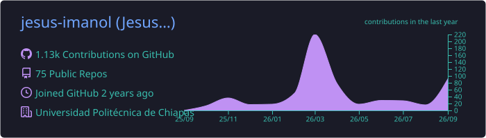
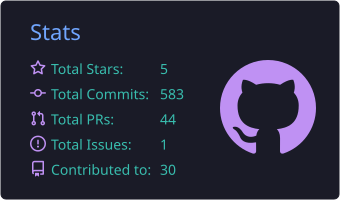
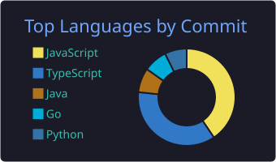

<!-- Header -->

  

  
  
  
  

---

## 🧑‍💻 About me

<table>
  <tr>
    <td width="55%" valign="middle">

- 🏗️ I design software **architecture-first**: Hexagonal, Clean Architecture and **Event-Driven** microservices.
- 🐹 Backend with **Go**, **TypeScript** and **Python**; messaging with **RabbitMQ** and WebSockets.
- 📱 Frontend & mobile with **Vue**, **React**, **Angular** and **Kotlin (Android · Hilt)**.
- 🔬 Curious about fundamentals: I built a **compiler / lexical analyzer** and play with **ESP32** hardware.
- 🤖 I use **AI to accelerate engineering, never to replace it** (see below).
- 🇲🇽 Spanish (native) · English (learning)

</td>
    <td width="45%" align="center" valign="middle">
      
    </td>
  </tr>
</table>

---

## 🤖 AI-Augmented Engineering — not vibe coding

<table>
  <tr>
    <td width="45%" align="center" valign="middle">
      
    </td>
    <td width="55%" valign="middle">

> **AI writes code fast. Engineers decide what code should exist.**

I work with AI agents daily, but the **design, the boundaries and the responsibility stay with me**. AI is a pair programmer inside a system I understand — not a black box I copy from.

</td>
  </tr>
</table>

| Principle | How I apply it |
|---|---|
| 🧭 **Architecture before prompts** | I define domains, ports & adapters and contracts first. AI fills in implementations *inside* those boundaries. |
| 🔍 **Every line is reviewed** | I don't merge code I can't explain. Generated code goes through the same review as mine. |
| 🧪 **Tests are the contract** | TDD and tests validate AI output — "it runs" is not "it's correct". |
| 📐 **Context engineering** | Clear specs, project rules and small, scoped tasks instead of vague "build me an app" prompts. |
| 🔐 **Responsible & secure** | No secrets or private data in prompts; I check dependencies, licenses and security of generated code. |
| 🧠 **Fundamentals first** | Data structures, SOLID, design patterns and compilers — so I can judge what the AI proposes. |

  
  
  
  

---

## 🛠️ Tech Stack

<b>Languages</b>  
  

<b>Frontend & Mobile</b>  
  

<b>Backend & Messaging</b>  
  

<b>Databases</b>  
  

<b>Cloud, DevOps & Tools</b>  
  

<b>Architecture & Practices</b>  
  
  
  
  
  
  
  
  

---

## 🚀 Featured Projects

| Project | What it shows | Stack |
|---|---|---|
| [**oauth_go_hexagonal**](https://github.com/jesus-imanol/oauth_go_hexagonal) | OAuth authentication built on ports & adapters |  |
| [**first_api_event_driven**](https://github.com/jesus-imanol/first_api_event_driven) | Event-driven API publishing to RabbitMQ |   |
| [**microservicios**](https://github.com/jesus-imanol/microservicios) | Microservices-based system |  |
| [**clean_arquitecture_vue**](https://github.com/jesus-imanol/clean_arquitecture_vue) | Clean Architecture applied to the frontend |  |
| [**mi_ES_compiler**](https://github.com/jesus-imanol/mi_ES_compiler) | A compiler for a Spanish-based language |  |
| [**di_android_hilt_ksp**](https://github.com/jesus-imanol/di_android_hilt_ksp) | Dependency injection on Android with Hilt + KSP |  |
| [**Blockchain-complaint**](https://github.com/jesus-imanol/Blockchain-complaint) | Blockchain-backed complaint system |  |

---

## 📊 GitHub Stats

<!-- Cards generated by .github/workflows/profile-cards.yml -->

  

  
  

  

<!-- Pac-Man generated by .github/workflows/snake.yml -->

  

